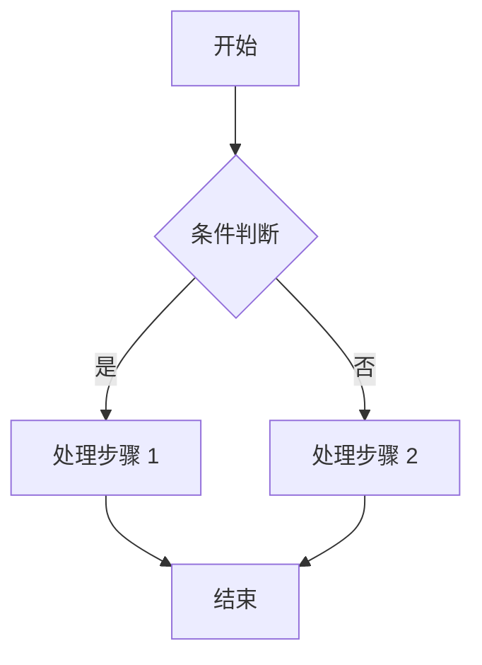
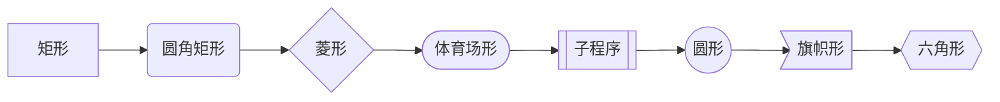
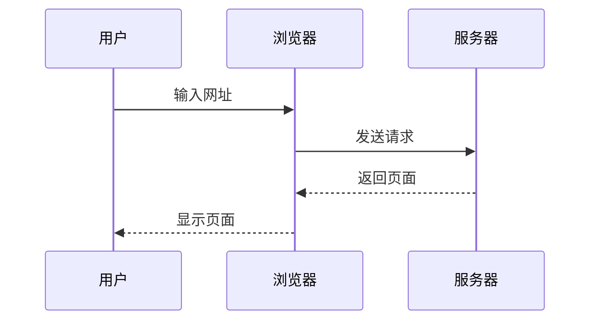
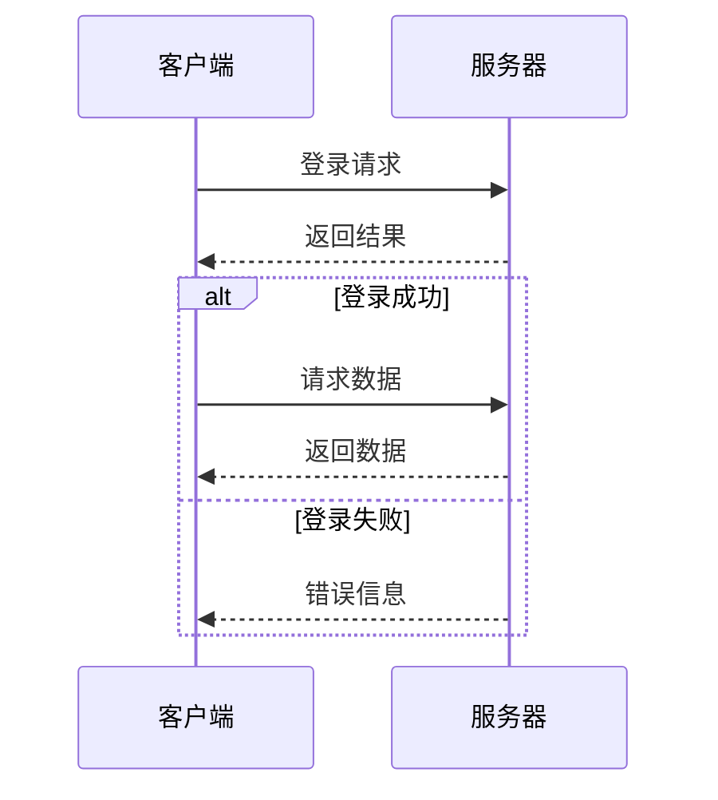
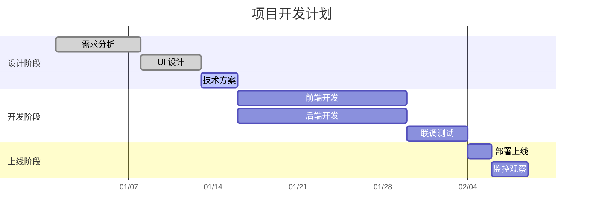
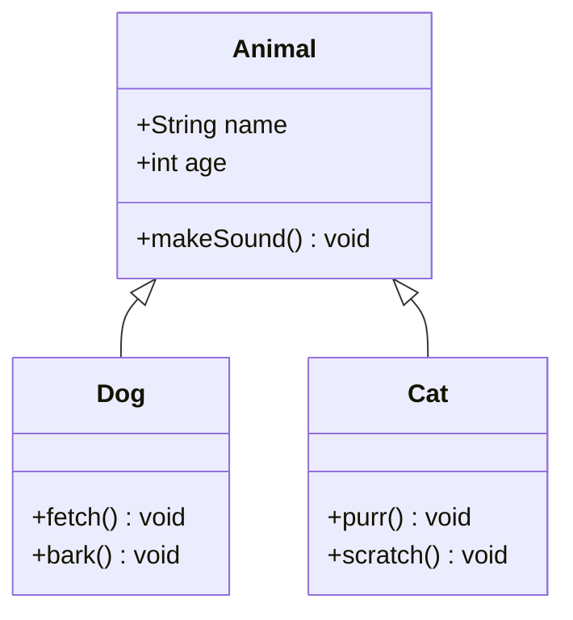
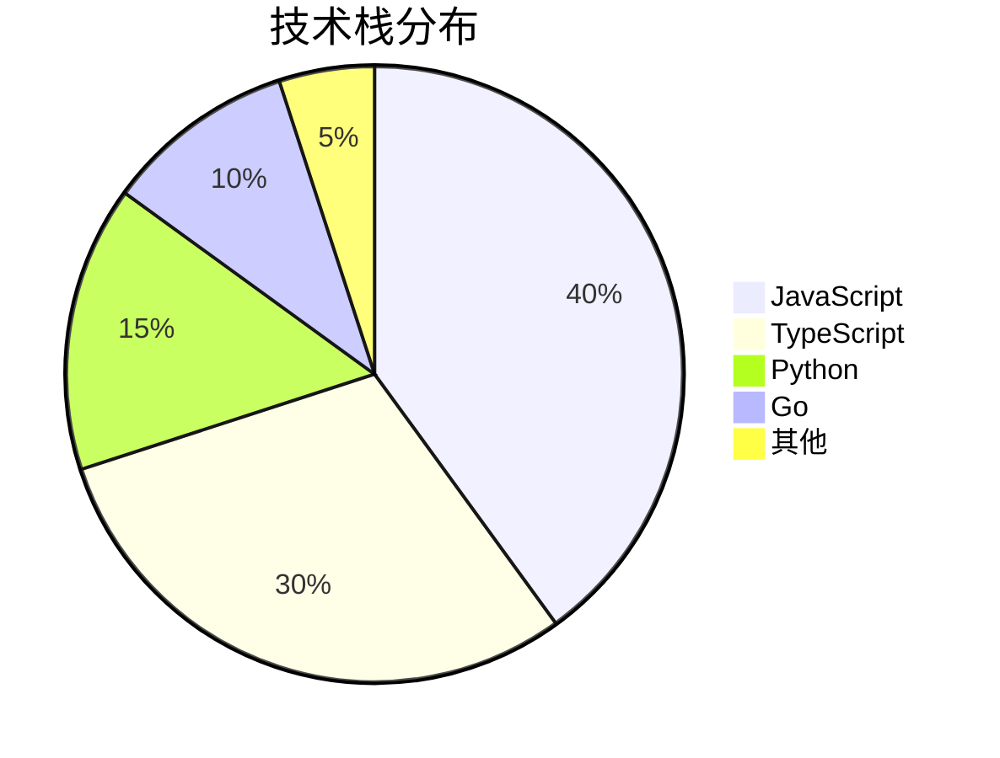
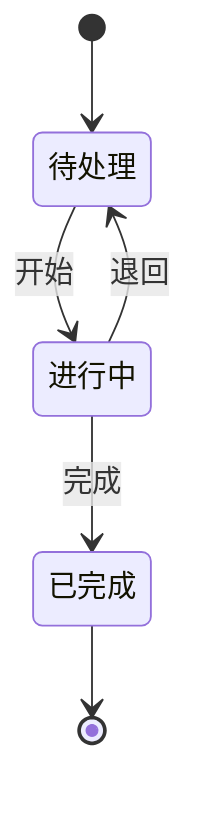
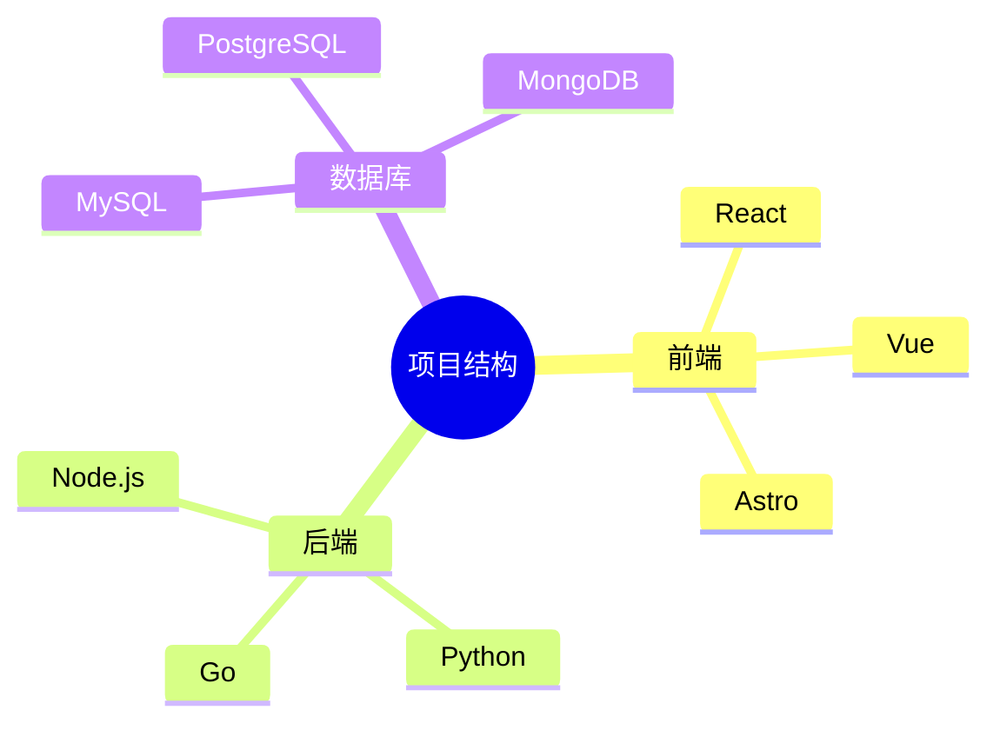

Mizuki 主题内置 [Mermaid](https://mermaid.js.org/) 图表引擎，允许在 Markdown 文章中直接编写和渲染各类图表。

## 基础用法

使用围栏代码块并指定 `mermaid` 语言标识来创建图表：

````markdown
```mermaid
图表定义内容
```
````

## 流程图

流程图用于表示过程或算法步骤。

### 方向语法

| 关键字 | 说明 |
|--------|------|
| `TD` 或 `TB` | 从上到下 |
| `BT` | 从下到上 |
| `LR` | 从左到右 |
| `RL` | 从右到左 |

### 示例

````markdown

````

### 节点形状



## 时序图

时序图展示对象之间随时间的交互。

### 示例

````markdown

````

### 消息类型

| 语法 | 说明 |
|------|------|
| `->>` | 实线箭头 |
| `-->>` | 虚线箭头 |
| `-x` | 实线交叉箭头 |
| `--x` | 虚线交叉箭头 |

### 条件分支

使用 `alt`、`else`、`opt` 等关键字：

````markdown

````

## 甘特图

甘特图用于展示项目进度和时间安排。

````markdown

````

### 任务状态

| 状态 | 语法 | 说明 |
|------|------|------|
| 已完成 | `done` | 灰色显示 |
| 进行中 | `active` | 高亮显示 |
| 待办 | 无标记 | 默认显示 |
| 危急 | `crit` | 红色标记 |

## 类图

类图用于表示类与类之间的关系。

````markdown

````

### 关系类型

| 语法 | 说明 |
|------|------|
| `<\|--` | 继承 |
| `*--` | 组合 |
| `o--` | 聚合 |
| `-->` | 关联 |
| `--` | 实线连接 |
| `..>` | 依赖 |

## 饼图

饼图用于展示数据的比例关系。

````markdown

````

## 状态图

状态图用于描述对象的状态变化。

````markdown

````

## 思维导图

````markdown

````

## 注意事项

1. Mermaid 图表基于 JavaScript 渲染，需要浏览器启用 JavaScript
2. 图表在暗色和亮色主题下会自动适配
3. 复杂图表可能会影响页面加载性能
4. 图表中的中文文字需要使用英文引号包裹
5. 语法错误会导致图表无法渲染，请仔细检查语法
6. 建议在图表定义中保持良好的缩进格式
